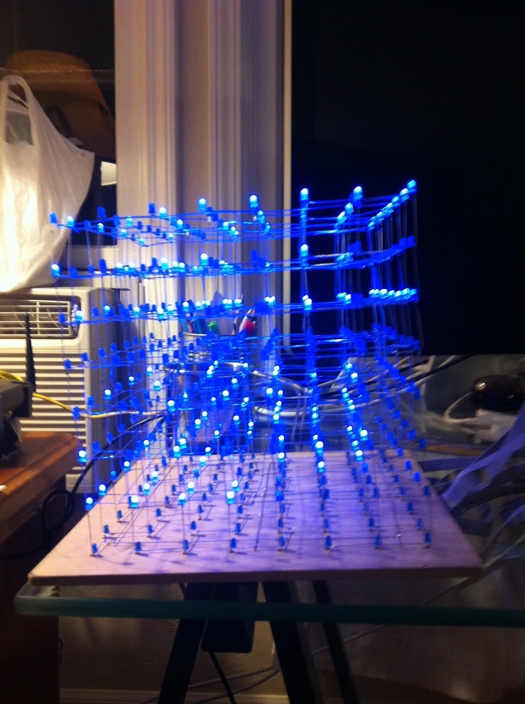
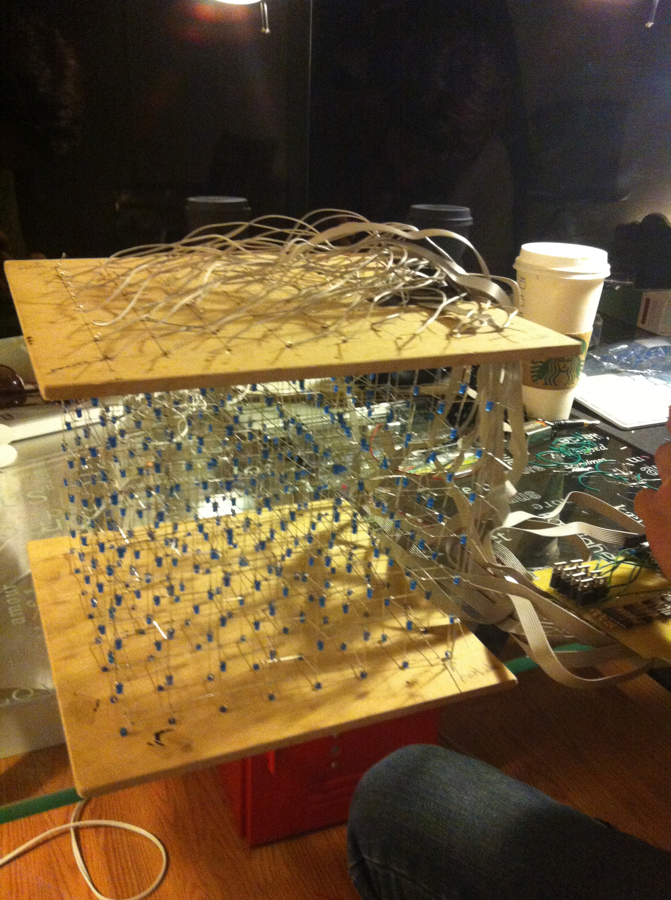

8x8x8 LED Cube
==============

This is a project to build an 8x8x8 LED Cube like the one found at http://www.instructables.com/id/Led-Cube-8x8x8/

I improved on their schematic a bit by using chainable shift registers, which lets you build the whole thing using just 11 total output pins from the microcontroller. It could probably be simplified further.

Schematic:

